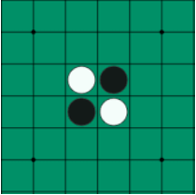

# Othello Game (Othello)

Othello is a two-player board game played on a square board. Each player has pieces of a specific color (black or white).

### Main Rules of the Game:

* A player must place a piece on a square such that at least one or more of the opponent's pieces are trapped between the new piece and one of their own existing pieces.
* All opponent pieces that are enclosed in this way are flipped to the color of the current player.
* The game ends when neither player has any legal moves left.
* The winner is the player who has the most pieces on the board at the end of the game.

## Environment
The game environment consists of a 6×6 board with two white pieces and two black pieces placed in the center (Figure 1).
Each agent, on every turn, only has access to the current game state (Game State) and must select the best possible move using the provided functions.
The main objective of the project is to design a decision-making agent.




## Implementation

The following files have been prepared by the teaching team and do **not** need to be modified:

```
game/
├── othello.py
agents/
├── random_agent.py
└── greedy_agent.py
tournament.py
```

The file `game/othello.py` contains the complete implementation of the game environment. The most important functions that will be used in the implementation of intelligent agents are introduced below:

- **`get_valid_moves(player)`**: Returns all legal moves for the player in the current game state.
- **`make_move(player, row, col)`**: Applies a move on the board and updates the game state according to the rules.
- **`copy()`**: Creates an independent copy of the current game state. This function is used when generating children in the Minimax and Alpha-Beta trees so that different moves can be examined without changing the original game state.
- **`game_over()`**: Checks if the game has ended.
- **`score()`**: Calculates the number of pieces each player has on the board.

Throughout the project, players are represented as follows:

```
BLACK = 1

WHITE = -1
```

Therefore, the opponent of any player can be easily obtained by multiplying by -1:  
`opponent = -player`

### What You Need to Implement:

**Part 1: Evaluation Function**  
In the file related to intelligent agents, implement the function `evaluate(game, player)`.  
This function should estimate the quality of a game state for the specified player.

**Part 2: Minimax**  
Complete the `MinimaxAgent` class.  
The algorithm should:
- Generate the game tree.
- Search up to the specified depth.
- Select the best move.
- Use the evaluation function when the depth limit is reached.

**Part 3: Alpha-Beta Pruning**  
Complete the `AlphaBetaAgent` class.  
The algorithm should:
- Have performance equivalent to Minimax.
- Reduce the number of nodes examined using **Alpha-Beta Pruning**.

### Experiments

Test your agents with different depths and record the results.

### Performance Evaluation

Run your implemented agents against the following agents:
- **Random Agent**
- **Greedy Agent**

For each experiment, run **at least 20 games**.

**Sample Results Table:**

| Agent          | Number of Games | Number of Wins | Win Rate |
|----------------|-----------------|----------------|----------|
| Random         | 20              | 2              | 10%      |
| Greedy         | 20              | 15             | 75%      |

## How to Run

Check the `main.py` file. In this file, you can enter your agents to play against the other mentioned agents and observe the final score of the game.

## Evaluation Method

For evaluating your agents, a **Round-Robin Tournament** method is used. In this method, each agent in the group plays directly against the agents implemented by other groups, and their performance is compared based on the game results.

> **Note:** The environment used during evaluation is **not necessarily** 6×6!

## Expected Analysis

In your report, answer the following questions:

1. What effect did increasing the search depth have on the quality of play?
2. What effect did **Alpha-Beta Pruning** have on execution time?
3. What criteria did you use in the evaluation function?
4. What was the most important factor in the success of your agent?
5. What are the weaknesses of your evaluation function?

The report must include the following sections:

1. Explanation of the Implementation Method  
2. Explanation of the Evaluation Function  
3. Experimental Results  
4. Comparison Table of **Minimax** and **Alpha-Beta**  
5. Analysis of Results
